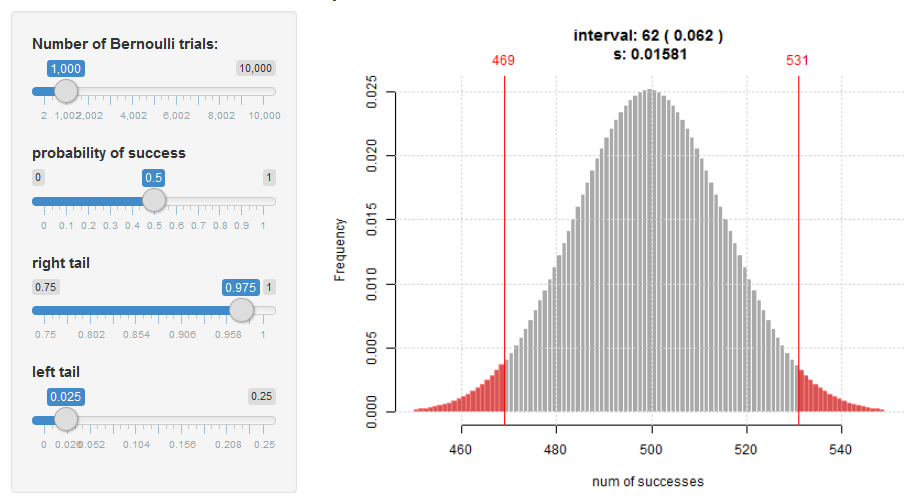
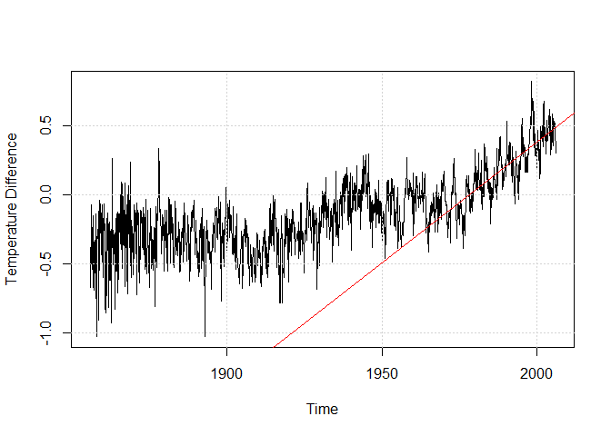
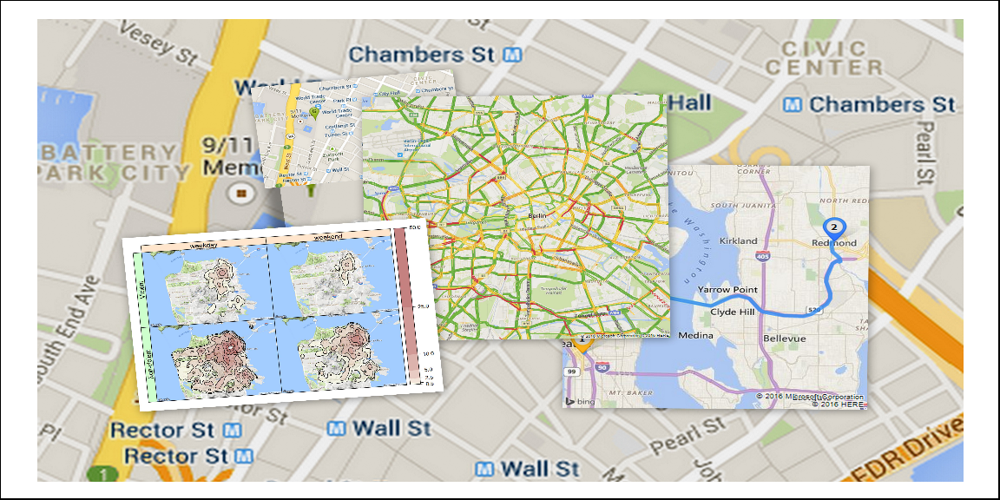

About this workshop
===================

Goals
-----

This 2.5 day workshop is intended to leave participants up and running with R statistical software. It is an attempt to provide the solid foundation needed to begin using R in your data analysis and statistical needs. No previous experience is required, though some basic programming or data science experience is helpful.

Agenda
------

### Day 1: Basic R programming

-   data types, vectors, matrices, strings, factors
-   control structures (for, if else, while)
-   functions, R markdown
-   basic plotting
-   regression and probability distributions
-   hypothesis tests

### Day 2: Intermediate and advanced R programming topics

-   Data visualization with ggplot2
-   Packages for faster data manipulation (dplyr, data.table)
-   Interactive javscript based plots
-   time series

### Day 3 (optional half-day):

-   Maps in R

------------------------------------------------------------------------

Statistics with R
-----------------



Time Series Analysis
--------------------



Maps in R
---------



Interactive
-----------

If time permits, We will

-   cover dynamic map mashups that allow zoom and pan operations, in particular the packages *leaflet* and *plotGoogleMaps*.
-   introduce a spatial hotspot detection tool based on classification trees and generalized additive models.

How you should prepare
======================

The workshop will contain plenty of hands-on, interactive explorations of real data sets with relevant spatial and temporal information. While not strictly required, a basic familiarity with the *R* language and its popular IDE *RStudio* will be helpful.

### Required libraries

``` r
install.packages(c("knitr", "markdown", "rmarkdown","ggplot2","leaflet", "dygraphs","ggmap", "RgoogleMaps"))
```

### Data sets

-   [Titanic](data/TitanicTrain.csv)
-   [Global Temperature](data/global.dat)
-   [birth weights](data/BirthWeights.rda)

------------------------------------------------------------------------

### Links

[Berlin School of Economics and Law](http://www.hwr-berlin.de "BSEL Homepage")

[Prof. Markus Loecher](http://www.hwr-berlin.de/fachbereich-wirtschaftswissenschaften/kontakt/personen/kontakt-info/2184/ "ML official university link")

[my blog](https://blog.hwr-berlin.de/codeandstats/ "blog")

[my RgoogleMaps package](http://rgooglemaps.r-forge.r-project.org/ "RgoogleMaps on Rforge")
