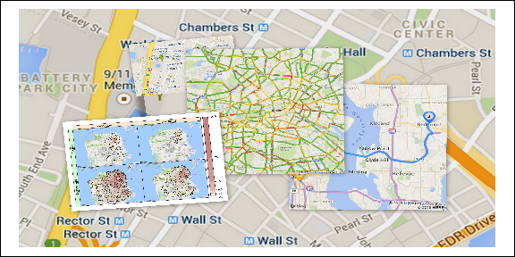

About this workshop
===================

Goals
-----

This 2.5 day workshop is intended to leave participants up and running
with R statistical software. It is designed to provide the solid
foundation needed to conduct data analysis and visualization for data
science. No previous experience is required, though some basic
programming or data science experience is helpful.

Agenda
------

### Day 1: Basic R programming

-   data types, vectors, matrices, strings, factors,
-   control structures (for, if else, while)
-   functions, Rmd
-   basic plotting
-   regression and probability distributions
-   hypothesis tests

### Day 2: Intermediate and advanced R programming topics

-   Data visualization with ggplot2
-   Packages for faster data manipulation (dplyr, data.table)
-   Interactive javscript based plots
-   time series

### Day 3 (optional half-day):

-   Maps in R

Statistics with R
=================

Data Manipulation
=================

Time Series Analysis
====================

Maps in R
=========

A multitude of modern data sets gathered such as location information
from mobile devices, surveys, crime records, vehicle tracks, demographic
data, etc. require a map based spatial context for even the most basic
data explorations. In those settings, the somewhat narrow or "blind"
exploration of spatial data on a blank background can be rather limiting
and often leads to less insight than would be possible had the data been
graphed on a map canvas. While there exist many html and/or GIS based
solutions to this simple problem, the overhead of switching tools and
environments can be detrimental to efficient development.

In this workshop you will learn about recent advances in the conditional
visualization of spatial/spatiotemporal data in R. While the main focus
is set on the packages **RgoogleMaps** and **loa**, you will also become
familiar with the corresponding ggplot implementation, *ggmap*.

Interactive
===========

If time permits, We will

-   cover dynamic map mashups that allow zoom and pan operations, in
    particular the packages *leaflet* and *plotGoogleMaps*.
-   introduce a spatial hotspot detection tool based on classification
    trees and generalized additive models.

How you should prepare
======================

The workshop will contain plenty of hands-on, interactive explorations
of real data sets with relevant spatial and temporal information. While
not strictly required, a basic familiarity with the *R* language and its
popular IDE *RStudio* will be helpful.

### Required libraries

### Data sets

Links
=====

[Berlin School of Economics and
Law](http://www.hwr-berlin.de "BSEL Homepage")

[Prof. Markus
Loecher](http://www.hwr-berlin.de/fachbereich-wirtschaftswissenschaften/kontakt/personen/kontakt-info/2184/ "ML official university link")

[my blog](https://blog.hwr-berlin.de/codeandstats/ "blog")

[my RgoogleMaps
package](http://rgooglemaps.r-forge.r-project.org/ "RgoogleMaps on Rforge")
